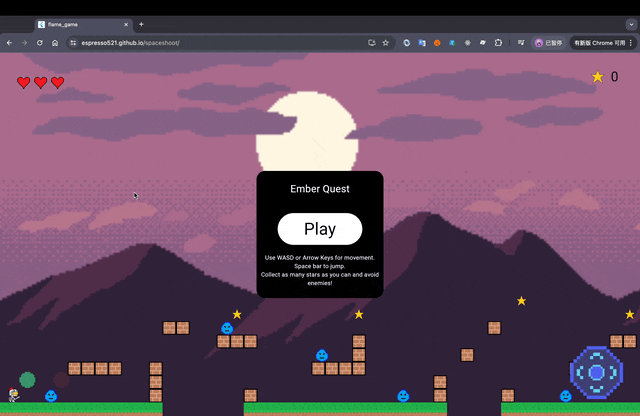
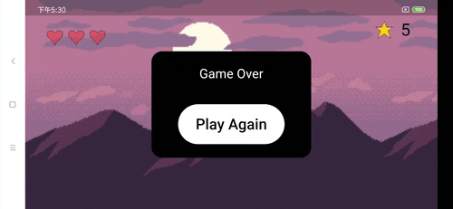

# flame_game

A Flutter project that build game with flame.

## Getting Started

This is the first side-scrolling game I’ve made using Flutter and Flame, and it only took me 5 days. 

It's can be play by web and phone. 📱

It’s truly amazing. ⭐

I want to create a fun game for my son. 🧒

- [FLAME](https://docs.flame-engine.org/latest/index.html)

You can checkout myspaceshoot branch to check the source code. 🥦

I delpoyed the game by github action, have a try!   
https://espresso521.github.io/spaceshoot/

